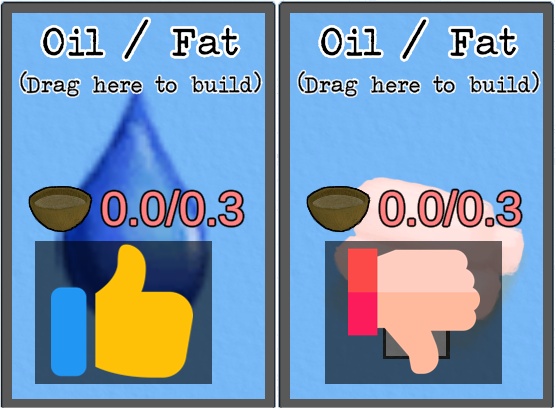

# v1.04 Note
This is only compatible with the 1.04 beta called "updatebranch" in Steam.

# Priority Ingredients
When using the auto fill option in the build screen, the game will search for compatible cards to add.  However, this search is alphabetical so for something that requires a hammering tool will try to use an axe over a stone.  The same is true for fat vs oil.

This mod allows the user to define the list of cards to search for first.
By default the list is: oil, stone, sharpened stone.  The preferred cards and search order can be configured.

# Settings
|Name|Default|Description|
|--|--|--|
|CardPriorityList|(See Below)|A comma delimited list of card names to use, in order of preference.  The full list of cards can be found at https://github.com/NBKRedSpy/CardSurvival-DoNotSteal/blob/master/CardList.txt|

Default cards and order:
LQ_Oil,Stone,StoneSharpened,StoneAxe,AxeFlint,AxeCopper,AxeScrap,AxeSurvival,AxeSurvivalBlunt

# Changing the Configuration
All options are contained in the config file which is located at ```<Steam Directory>\steamapps\common\Card Survival Tropical Island\BepInEx\config\CardSurvival-PriorityIngredients.cfg```.

The .cfg file will not exist until the mod is installed and then the game is run.

To reset the config, delete the config file.  A new config will be created the next time the game is run.

# Installation 
This section describes how to manually install the mod.

**If using the Vortex mod manager from NexusMods, these steps are not needed.**

## Overview
This mod requires the BepInEx mod loader.

## BepInEx Setup
If BepInEx has already been installed, skip this section.

Download BepInEx from https://github.com/BepInEx/BepInEx/releases/download/v5.4.21/BepInEx_x64_5.4.21.0.zip

* Extract the contents of the BepInEx zip file into the game's directory:
```<Steam Directory>\steamapps\common\Card Survival Tropical Island```

    __Important__:  The .zip file *must* be extracted to the root folder of the game.  If BepInEx was extracted correctly, the following directory will exist: ```<Steam Directory>\steamapps\common\Card Survival Tropical Island\BepInEx```.  This is a common install issue.

* Run the game.  Once the main menu is shown, exit the game.
    
* In the BepInEx folder, there will now be a "plugins" directory.

## Mod Setup
* Download the CardSurvival-PriorityIngredients.zip.  
    * If on Nexumods.com, download from the Files tab.
    * Otherwise, download from https://github.com/NBKRedSpy/CardSurvival-CardSurvival-PriorityIngredients/releases/

* Extract the contents of the zip file into the ```BepInEx/plugins``` folder.

* Run the Game.  The mod will now be enabled.

# Uninstalling

## Uninstall
This resets the game to an unmodded state.

Delete the BepInEx folder from the game's directory
```<Steam Directory>\steamapps\common\Card Survival Tropical Island\BepInEx```

## Uninstalling This Mod Only

This method removes this mod, but keeps the BepInEx mod loader and any other mods.

Delete the ```CardSurvival-PriorityIngredients.dll``` from the ```<Steam Directory>\steamapps\common\Card Survival Tropical Island\BepInEx\plugins``` directory.

# Compatibility
Safe to add and remove from existing saves.

# Credits
<a href="https://www.flaticon.com/free-icons/like" title="like icons">Like icons created by Pixel perfect - Flaticon</a>
<a href="https://www.flaticon.com/free-icons/thumbs-down" title="thumbs down icons">Thumbs down icons created by Freepik - Flaticon</a>

# Change Log 

## 1.0.0
* Release

## 1.0.1
* Added entire family of axes